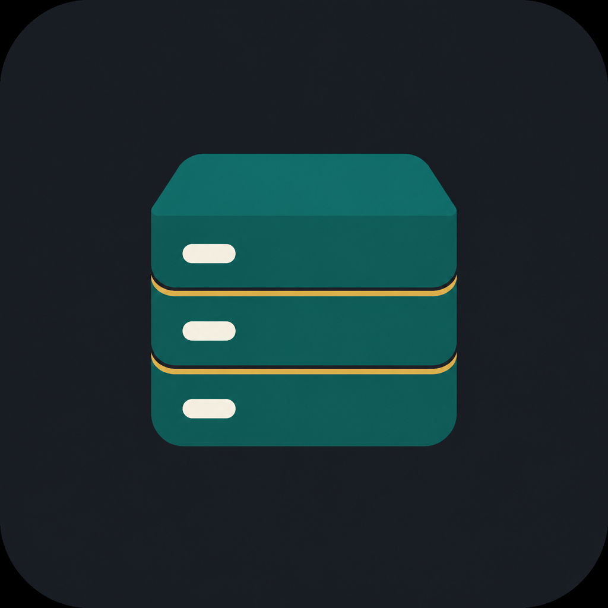

<p align="center">
  
</p>

# rowkit

Streaming JSONL and CSV toolkit for people who work with datasets that do not fit in a spreadsheet.

Infer a schema, validate required fields, reservoir-sample rows, split train/test, and drop duplicates — all from the command line, without loading the whole file into memory.

[](https://github.com/theworker02/rowkit/actions/workflows/ci.yml)
[](https://www.npmjs.com/package/@magnexis/rowkit)
[-blue.svg)](LICENSE)

## Install

```bash
npm install -g @magnexis/rowkit
# or
npx @magnexis/rowkit --help
```

Requires Node.js 20+.

## Why

JSONL dumps from scrapers, USPTO bulk files, LLM evals, and event logs are huge and messy. You usually need answers like:

- Which fields exist, and are they always the same type?
- How many rows are missing `id`?
- Give me 50 representative lines, not the first 50.
- Split 80/20 without shuffling the entire file in RAM.

rowkit is a small CLI for those jobs.

## CLI

```text
rowkit infer <file> [--format jsonl|csv] [--json] [-o schema.json]
rowkit stats <file>
rowkit sample <file> -n 50 --seed 7
rowkit validate <file> --require id,title
rowkit dedupe <file> --keys id -o unique.jsonl
rowkit split <file> --ratio 0.8 --train train.jsonl --test test.jsonl --seed 1
```

### infer

Walks every row, flattens nested JSON with dotted paths, and prints a table:

```text
field     kind     present  missing  min  max
id        integer  1200     0        1    1200
title     string   1194     6
score     number   1200     0        0    1
```

`--json` emits the full per-field kind histogram and unique samples.

### validate

Exit code `1` when any required field is missing or null. CI-friendly JSON:

```json
{ "ok": false, "errors": ["line 12: missing required field \"title\""] }
```

### sample / split

Both use a seeded LCG so the same `--seed` reproduces the same draw. `sample` is reservoir sampling (one pass). `split` writes JSONL even when the source is CSV.

### dedupe

Hashes either the whole flattened row or `--keys a,b`. Output is always JSONL.

## Library

```ts
import { infer, validate } from "@magnexis/rowkit";

const schema = await infer("events.jsonl", "jsonl");
const { ok } = await validate("events.jsonl", "jsonl", ["id"]);
```

## Development

```bash
git clone https://github.com/theworker02/rowkit.git
cd rowkit
npm install
npm test
npm run build
node dist/cli.js --help
```

## License

**Source-available proprietary** — evaluation under [LICENSE](./LICENSE); commercial / production use via [COMMERCIAL.md](./COMMERCIAL.md). See [LICENSE_TRANSITION_NOTICE.md](./LICENSE_TRANSITION_NOTICE.md) and [NOTICE](./NOTICE).


---

## License & acquisition

This project is **proprietary**. Production use, redistribution, and commercial deployment require a written commercial license or completed acquisition. See [LICENSE](./LICENSE) and [ACQUISITION.md](./ACQUISITION.md). Contact [@theworker02](https://github.com/theworker02).

## Status

rowkit is actively packaged for commercial licensing and acquisition diligence. See [ACQUISITION.md](./ACQUISITION.md) and [docs/acquisition/](./docs/acquisition/).
